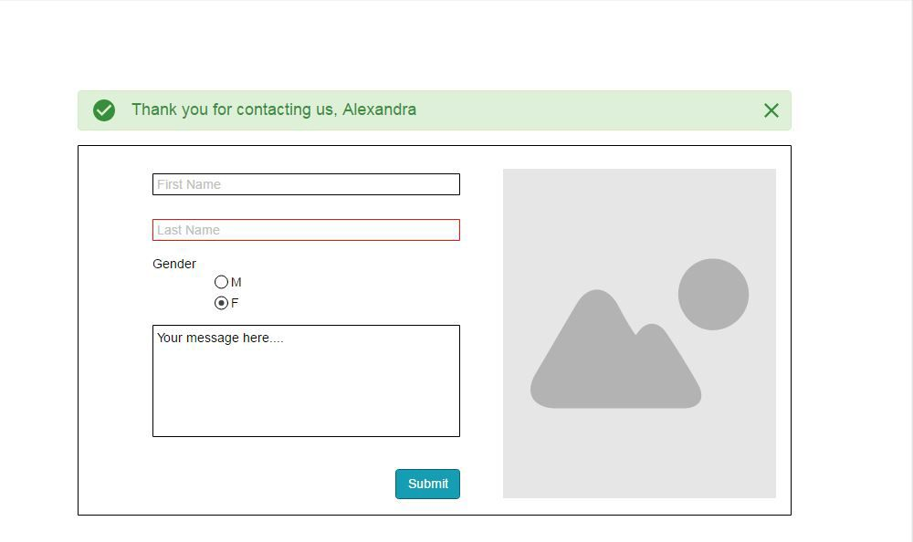

# Implement a Contact form component. 

## Requirements
1. Your form should have: 
    - 2 text inputs, 
    - 1 radio button, 
    - 1 textarea, 
    - 1 submit button 
    - (optional) an image on the right, just to make the form look a little better.

2. When clicking the “Submit” button, you should validate the required fields, and display a red border around the input if validation fails. The fields validation consist in :
    - textboxes and textarea should contain text 
    - the radio button should have one option selected

3. If user corrects the error, you should remove the red border.

4. When the form is successfully submitted (no validation errors) you should display a Confirmation banner (which is hidden initially) containing the user’s first name that you just collected from the input fields. Also all the info from the input fields should be printed in the Console.

## UI suggestion
